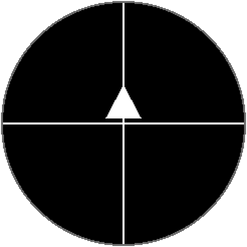

# Mounting the screen in the dome

A holoprojector's lens sits over the panel, and both how the panel is *centred* under it and which
way round it is *rotated* show up in every clip afterwards. `screen calibration` puts up a pattern
made for judging exactly those two things by eye, while the board is in your hand and before
anything is glued or tightened.

## The pattern

```
screen calibration
```

A white crosshair on black: one line across the panel's full width, one down its full height, and a
solid arrowhead sitting on the vertical line just above the crossing, pointing **up**.

<figure markdown>
{ width="320" }
<figcaption>What `screen calibration` puts on the panel, pixel for pixel.</figcaption>
</figure>

Both lines are two pixels thick. The panel is 240 pixels across, so its centre falls on the seam
between pixels 119 and 120 rather than on a pixel, and each line straddles that seam — the crossing
is the panel's true centre, not a pixel either side of it. **If a line looks off-centre behind the
lens, it is the mounting, not the firmware.**

The pattern stays up until something else is shown. `screen` on its own reports it, and
`screen clear` takes it down and puts the panel back to sleep.

The picture above is generated from the firmware's own geometry by
`tools/render_calibration.py`, and `make docs-check` fails if the two ever disagree.

!!! tip "`screen calib` does the same thing"
    Alignment is fiddly and the command gets typed a lot. Both spellings work.

## Aligning

1. Flash the firmware and open the console — see [Build and flash](../install/flashing.md).
2. Run `screen calibration`. The panel wakes with the pattern already in place.
3. Hold or rest the board in the dome and **centre it**: the crossing goes in the middle of the
   lens opening, and the two lines should reach the edge of the aperture by the same amount all
   the way round.
4. **Rotate it** until the arrow points at the top of the dome. This is the only part of the
   pattern that is not symmetric, and it is the whole reason it is there — a crosshair alone looks
   right at all four rotations.
5. Fix the panel in place, then run `screen calibration` again and check nothing shifted while you
   were tightening it.
6. `screen clear` when you are done.

If the dome's aperture is smaller than the panel, aim for the lines being cut off equally on
opposite sides rather than for seeing all four arms in full.

## Judging brightness at the same time

The lit area's edge is much easier to see at a low backlight, and a dim panel is also the honest
test of whether the lens is sitting flat:

```
lcd bl 20
screen calibration
```

`lcd bl 100` puts it back. The level survives until the next restart; see
[Console commands](../reference/console.md).

## Why this carries over to clips

`video play` draws every frame centred on the same 240×240 panel, so the crossing is where a clip's
centre lands and the arrow is which way a clip's "up" points. Align the crosshair and the clips are
aligned; there is no separate offset or rotation setting in the firmware to correct for a panel
that went in crooked.

A clip is the final check. Put one on the board and play it — see
[Video clips](../use/video.md) — and the pattern has done its job if the picture is centred in the
lens and the right way up.

!!! note "The panel is round, the frame is square"
    The GC9A01 is a 240×240 panel with a circular visible area, so the very ends of the crosshair's
    arms disappear under the bezel. That is the panel, not a drawing error — the lines do run the
    full width and height.
